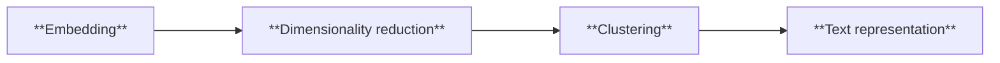

# Reddit Trend Analyzer

## 💻 This is the backend service for a web application that:
- fetches **trending Reddit topics**
- analyzes the **sentiment** of public discussions
- and enables **filtering topics by sentiment** (positive, negative, neutral)

> 🚧 This project is in early development.

## 🛠️ Tech Stack (Planned)

- **Language:** [Python](https://docs.python.org/3/)
- **Framework:** [Flask](https://flask.palletsprojects.com/en/stable/)
- **Reddit API:** [Async PRAW](https://asyncpraw.readthedocs.io/en/stable/)
- **Topic modeling:** [BERTopic](https://maartengr.github.io/BERTopic/index.html)
- **Sentiment analysis:** VADER or TextBlob or Hugging Face *(TBD)*
- **Database:** *(TBD)*

## 🚀 Getting Started

### Development Setup
- Clone the repository:
```bash
git clone https://github.com/ohjelmistoprojekti-ii-reddit-app/reddit-app-backend.git
```
- Create Virtual Environment for the project in the project folder with command:
```bash
python -m venv venv
```
- Activate the Virtual Environment (this has to be done every time you open new terminal):
```bash
venv\Scripts\activate
```
- Install requirements to get started:
```bash
pip install -r requirements.txt
```

### Connecting to Reddit API (Async PRAW)
Assuming you have already registered an app to Reddit's developer portal:
- Create **.env** file in the root of the project
- Add your Reddit app credentials to the file:
```
REDDIT_CLIENT_ID=your_client_id
REDDIT_CLIENT_SECRET=your_client_secret
REDDIT_USER_AGENT=your_user_agent
```

### Run the demo
The app is still in early development, so there's not much you can do.

However, you can view example Reddit posts and topic modeling results by running the script:
```bash
python demo.py
```

The results will be printed in your terminal.

💡 You can change the subreddit, type of posts and number of posts in `demo.py` to experiment with different data.

## 🔎 Solutions Overview
An overview of our solutions and approaches across the project's key areas.

<details>
<summary><strong>Topic Modeling</strong></summary>

**Topic modeling** is a natural language processing (NLP) technique for identifying themes and topics from text data.

There are multiple tools available for this task, and for this project, we chose **BERTopic**, a modern model that leverages machine learning to extract easily interpretable topics.

<strong>Core concepts of BERTopic</strong>



**Embedding**: Turns text into numbers in a way that keeps track of meaning — for example, words like “movie” and “film” end up close to each other because they mean similar things.<br>
**Dimensionality reduction**: Reduces these numbers into a simpler form, so that patterns (like groups of related discussions) are easier to spot.<br>
**Clustering**: Groups together texts that are about similar topics.<br>
**Text representation**: Labels each group with a few key words that capture its main theme.<br><br>

<strong>Why use BERTopic on Reddit data?</strong>

Reddit discussions are already organized into different topics as **subreddits**, so someone might wonder why we would use topic modeling on Reddit at all. We wanted to take our Reddit analysis a step further and see if recurring themes or topics could be found *within* large subreddits.

Reddit discussions are diverse, informal and full of slang and memes, making the data challenging to analyze. BERTopic is an intelligent topic modeling approach that captures the meaning behind words using contextual embeddings, allowing it to understand nuances that traditional models like LDA often miss. We believe this makes it well-suited for extracting meaningful topics from a large, messy and broad dataset like Reddit.

**Learn more on this topic**:
- [What is Topic Modeling? An Introduction With Examples](https://www.datacamp.com/tutorial/what-is-topic-modeling) by Kurtis Pykes (Datacamp)
- [Advanced Topic Modeling with BERTopic](https://www.pinecone.io/learn/bertopic/) by James Briggs (Pinecone)
- [BERTopic official documentation](https://maartengr.github.io/BERTopic/algorithm/algorithm.html#visual-overview)
</details>

<details>
<summary><strong>Sentiment Analysis</strong></summary>
Coming soon
</details>

<details>
<summary><strong>REST API</strong></summary>
Coming soon
</details>

<br>

> Note: ChatGPT helped phrase parts of this README.