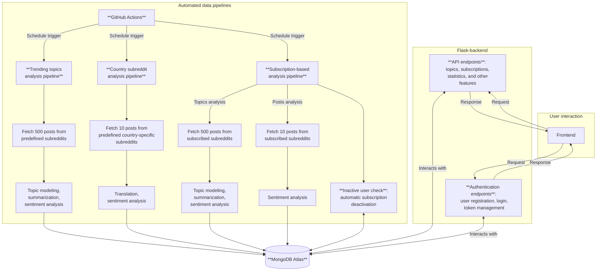

# Reddit Trend Analyzer

This is the **backend service** for a web application that:
- fetches **popular Reddit posts**
- identifies **trending topics** using topic modeling
- makes a brief **summary of the topic** based on the posts
- analyzes **sentiment** of public discussions
- and enables **filtering** topics by sentiment (positive, negative, neutral) and category (e.g., technology, entertainment, sports)

<details open>
<summary><strong>Table of Contents</strong></summary>

- [🛠️ Tech Stack](#️-tech-stack)
- [🏛️ Architecture Overview](#️-architecture-overview)
- [🚀 Getting Started](#-getting-started)
  - [Development Setup](#development-setup)
  - [Connecting to Reddit API (Async PRAW)](#connecting-to-reddit-api-async-praw)
  - [Connecting to MongoDb Atlas](#connecting-to-mongodb-atlas)
  - [Run the demo](#run-the-demo)
- [🌐 REST API](#-rest-api)
  - [Trending topics analysis endpoints](#trending-topics-analysis-endpoints)
  - [Statistics endpoints](#statistics-endpoints)
  - [Country subreddit analysis endpoints](#country-subreddit-analysis-endpoints)
  - [User authentication endpoints](#user-authentication-endpoints)
  - [Subscriptions endpoints](#subscriptions-endpoints)
  - [No database endpoints](#no-database-endpoints)
- [🔎 Solutions Overview](#-solutions-overview)
- [➡️ Useful Links](#useful-links)

</details>

> This project was created as part of the Software Development Project II course at Haaga-Helia University of Applied Sciences, Finland. It is not affiliated with or endorsed by Reddit.


## 🛠️ Tech Stack
- **Language:** [Python](https://docs.python.org/3/)
- **Framework:** [Flask](https://flask.palletsprojects.com/en/stable/)
- **Reddit API:** [Async PRAW](https://asyncpraw.readthedocs.io/en/stable/)
- **Topic modeling:** [BERTopic](https://maartengr.github.io/BERTopic/index.html)
- **Sentiment analysis:** [VADER](https://vadersentiment.readthedocs.io/en/latest/index.html)
- **Translation and summarization:** [Flan-T5](https://huggingface.co/docs/transformers/model_doc/flan-t5)
- **Database:** [MongoDB](https://www.mongodb.com/)
- **Automations:** [GitHub Actions](https://docs.github.com/en/actions)
- **Testing**: [pytest](https://docs.pytest.org/en/stable/), [mongomock](https://github.com/mongomock/mongomock), [Allure Report](https://allurereport.org/docs/)

## 🏛️ Architecture Overview



**GitHub Actions** pipelines fetch and analyze Reddit data, performing topic modeling, summarization, sentiment analysis, and/or translation depending on the analysis type. The results are stored in **MongoDB Atlas**.

The **Flask** backend exposes APIs for retrieving analyzed data, managing user accounts, and handling subscriptions. Users interact with the system through a **Next.js** frontend, which communicates with the backend via API requests.

<p align="right"><a href="#reddit-trend-analyzer">Back to top 🔼</a></p>

## ⚠️ Notice

The automated data pipelines are currently **disabled**. The project is a demo for a school course, and we don't want to waste resources by keeping the automations running.

This means that the app is no longer daily updated with freshly analyzed data, and some features that rely on the pipelines (like subscriptions) do not fully work.

You can still explore the app with previously analyzed data:
- [Backend demo](https://reddit-app-backend.onrender.com) (under construction)
- [Frontend demo](https://reddit-analyzer-app-nine.vercel.app/)

❗ The backend API has no index view, which is why you might see an error message when accessing the root URL.

ℹ️ The automations can be easily enabled by uncommenting the `schedule` section in the GitHub Actions workflow files located in `.github/workflows` folder. If you want to run the pipelines manually, see [Solutions overview](#-solutions-overview) and GitHub Actions section for instructions.

<p align="right"><a href="#reddit-trend-analyzer">Back to top 🔼</a></p>

## 🚀 Getting Started

### Development Setup
- Clone the repository:
```bash
git clone https://github.com/ohjelmistoprojekti-ii-reddit-app/reddit-app-backend.git
```
- Create Virtual Environment for the project in the project folder with command:
```bash
python -m venv venv
```
- Activate the Virtual Environment (this has to be done every time you open new terminal):
```bash
venv\Scripts\activate
```
- Install requirements to get started:
```bash
pip install -r requirements.txt
```
- Add MongoDb Atlas server:
```bash
python -m pip install "pymongo[srv]"
```

### Connecting to Reddit API (Async PRAW)
Assuming you have already registered an app to Reddit's developer portal:
- Create **.env** file in the root of the project
- Add your Reddit app credentials to the file:
```
REDDIT_CLIENT_ID=your_client_id
REDDIT_CLIENT_SECRET=your_client_secret
REDDIT_USER_AGENT=your_user_agent
```

### Connecting to MongoDb Atlas
First log in to MongoDb Atlas and get your peronal connection string:
- Add your connection string to your **.env** file
```
ATLAS_CONNECTION_STR=your_connection_string
```

### Run the demo

View example Reddit analysis results by running the script:
```bash
python demo.py
```

The results will be printed in your terminal.

💡 You can change the subreddit, type of posts and number of posts in `demo.py` to experiment with different data.

<p align="right"><a href="#reddit-trend-analyzer">Back to top 🔼</a></p>

## 🌐 REST API

Start the Flask server by running:
```bash
python run.py
```

✅ When everything is working, you will see this message on your console: 'Running on http://127.0.0.1:5000'

**Available endpoints:**
- [No database endpoints](#no-database-endpoints)
  - [Get analyzed posts from Reddit (no database)](#get-analyzed-posts-from-reddit-no-database)
  - [Get translated and analyzed posts from Reddit (no database)](#get-translated-and-analyzed-posts-from-reddit-no-database)
- [Trending topics analysis endpoints](#trending-topics-analysis-endpoints)
  - [Get subreddits that have data available in the database](#get-subreddits-that-have-data-available-in-the-database)
  - [Get latest analyzed posts from the database](#get-latest-analyzed-posts-from-the-database)
- [Statistics endpoints](#statistics-endpoints)
  - [Get post number statistics for a subreddit in a given timeperiod](#get-post-number-statistics-for-a-subreddit-in-a-given-timeperiod)
  - [Get top topics statistics for a subreddit in a given timeperiod](#get-top-topics-statistics-for-a-subreddit-in-a-given-timeperiod)
- [Country subreddit analysis endpoints](#country-subreddit-analysis-endpoints)
  - [Get country subreddits that have data available in the database](#get-country-subreddits-that-have-data-available-in-the-database)
  - [Get latest analyzed country subreddit data from the database](#get-latest-analyzed-country-data-from-the-database)
- [User authentication endpoints](#user-authentication-endpoints)
  - [Register as a user](#register-as-a-user)
  - [Login as a user](#login-as-a-user)
  - [Refresh access token](#refresh-access-token)
  - [Logout](#logout)
  - [Delete the user account](#delete-the-user-account)
  - [Get current user info](#get-current-user-info)
- [Subscriptions endpoints](#subscriptions-endpoints)
  - [Get list of active subscriptions by analysis type](#get-list-of-active-subscriptions-by-analysis-type)
  - [Get subscriptions for current user](#get-subscriptions-for-current-user)
  - [Create a new subscription for current user](#create-a-new-subscription-for-current-user)
  - [Deactivate subscription for current user](#deactivate-subscription-for-current-user)
  - [Get latest analyzed data for current user's active subscription](#get-latest-analyzed-data-for-current-users-active-subscription)


## No database endpoints

ℹ️ These endpoints provide real-time Reddit data fetching and analysis without storing the data in the database. They can be used for testing or demo purposes.

### Get analyzed posts from Reddit (no database)

> GET /api/live-data/topics/{subreddit}

**Description**: Fetches posts directly from Reddit, performs topic modeling and sentiment analysis, and returns analyzed data. Data is not stored in the database.

⌛ This operation may take a few minutes depending on the amount of posts.

| Parameter | Description | Examples |
| --------- | ----------- | ------- |
| subreddit | [name of any subreddit](https://www.reddit.com/r/ListOfSubreddits/wiki/listofsubreddits/) | `all`, `music`, `technology` |

**Example request**:
```
http://127.0.0.1:5000/api/live-data/topics/technology
```

➡️ **Returns** up to 12 most popular topics from the subreddit along with sample posts and sentiment analysis results.

<details>
<summary><strong>Example response format</strong> (click to open)</summary>

Note that the order of fields may vary.
```jsonc
{
  "topic_id": 3, // Indicates the rank of the topic, starting from 0 which is the most popular topic
  "topic": ["AI", "Innovation", "Gadgets", "..."], // Keywords representing the topic
  "label": "AI Innovation Gadgets", // Official topic label
  "num_posts": 22, // Number of posts in this topic
  "posts": [ // Example posts with comments
    {
      "id": "abc123",
      "subreddit": "technology",
      "title": "AI model achieves new benchmark",
      "content": "A new AI model has set a record for image recognition accuracy.",
      "comments": [
        "This is amazing!",
        "Impressive results, can't wait to see it in action."
      ],
      "num_comments": 2,
      "score": 150,
      "upvote_ratio": 0.97
    },
    {
      "id": "def456",
      "subreddit": "technology",
      "title": "Tech company launches innovative gadget",
      "content": "The latest gadget has several cutting-edge features.",
      "comments": [
        "Looks promising!"
      ],
      "num_comments": 1,
      "score": 120,
      "upvote_ratio": 0.95
    }
  ],
  "sentiment_values": { // Sentiment analysis results
    "average_compound": 0.25,
    "average_neg": 10.0,
    "average_neu": 75.0,
    "average_pos": 15.0,
    "comment_count": 50
  },
}
```
</details>

### Get translated and analyzed posts from Reddit (no database)

> GET /api/live-data/posts/hot/{subreddit}

**Description**: Fetches 10 hot posts directly from Reddit, translates their title, content and comments into English, performs sentiment analysis on the comments, and returns the analyzed data. The data is not stored in the database.

| Parameter | Description | Examples |
| --------- | ----------- | ------- |
| subreddit | [name of any subreddit](https://www.reddit.com/r/ListOfSubreddits/wiki/listofsubreddits/) | `suomi`, `sweden`, `spain`, `mexico`, `italia`

**Example request**:
```
http://127.0.0.1:5000/api/live-data/posts/hot/italia
```
➡️ **Returns** Posts with original and translated content, including sentiment analysis on comments.

<details>
<summary><strong>Example response format</strong> (click to open)</summary>

```json
[
  {
    "comments": [
      "Immagino sia successo a [Firenze](https://www.ilgiornale.it/news/cronaca-locale/vandalismo-pro-pal-firenze-blocchi-cemento-sui-binari-2546511.html), cerchiamo di mettere le fonti, thanks.",
      "Attaccato da chi? Questo è un gesto molto pericoloso e non ha nessun senso e non c’entra niente con le manifestazioni pacifiche che ci sono state in questi giorni. Se davvero l’hanno fatto dei manifestanti vanno fermati.\nFortunatamente con tutte le telecamere di sicurezza di una stazione ferroviaria sarà facilissimo risalire ai responsabili, per caso il tuo amico ti ha detto dove è successo? Vedo che è notte quindi immagino tra ieri e oggi",
      "“manifestanti”.."
    ],
    "comments_eng": [
      "The image has been successfully re-created in [French] ( we are asking for the fonts, thanks.",
      "Accused of who? This is a very dangerous move and there is no sense and there is no sense in the peaceful demonstrations that we are experiencing in these days. If they really did make the manifestos. Unfortunately, with all the security cameras at a railway station, it will be easy to get to the responsible, if your friend has told you where it happened? I see that I am now comparing yesterday and today.",
      "This language is so far unsupported"
    ],
    "content": "So che verrò attaccato da molti, ma dopo questa ennesima bravata inizio a convincermi sempre di più che qui la situazione sta sfuggendo di mano a tutti. Volete manifestare? Bene, avete tutto il diritto di farlo, ma fatelo usando la testa e pensando alle conseguenze di ciò che fate. Proprio ieri avevo letto un post di un utente che raccontava che sua nonna è rimasta bloccata nel traffico per ore quando doveva andare a fare il suo ciclo di chemio… Una cosa a mio parere molto grave. Ieri sera ricevo questo video da un mio amico che lavora come macchinista. Questo gesto non è un gesto di protesta ma un vero e proprio attentato. Se un treno in corsa passava su quei blocchi c’era un alta possibilità che deragliasse… Risultato? Feriti e possibili morti di innocenti che stavano viaggiando su un semplice treno.",
    "content_eng": "So he would be beaten by many, but after this latest bravery he started to convince me constantly that the situation is worse than here. Volete manifestare? Well, you have all the directions to do it, but you kill it using the test and thinking about the consequences of what you kill. Yesterday I had a post on a poet who told me that his wife was stranded in traffic for hours when she needed to take her chemotherapy... A thing that makes me feel very bad. I'll be taking this video from a friend who works as a mechanic. This gesture is not a protest gesture but a real and committed one. If a train was in the path on those blocks there was a high possibility of crashing... result? Feriti and possible deaths of innocents traveling on a simple train.",
    "score": 579,
    "sentiment_values": {
      "average_compound": 0.242,
      "average_neg": 17.133,
      "average_neu": 66.767,
      "average_pos": 16.1
    },
    "title": "Manifestanti cercano di bloccare il traffico ferroviario mettendo blocchi di cemento sui binari",
    "title_eng": "Manifestos are trying to block traffic by putting cement blocks on the bridges."
  }
]
  
```
</details>

<p align="right"><a href="#reddit-trend-analyzer">Back to top 🔼</a></p>

## Trending topics analysis endpoints

### Get subreddits that have data available in the database
> GET /api/subreddits

**Description**: Retrieves list of subreddits that our `GitHub Actions` pipeline currently analyzes regularly. The analyzed data is stored in the database and can be accessed via `/api/topics/latest/{subreddit}` endpoint.

**Example request**:
```
http://127.0.0.1:5000/api/subreddits
```

➡️ **Returns** list of subreddits that have data available in the database.

<details>
<summary><strong>Example response format</strong> (click to open)</summary>

```json
[
  "worldnews",
  "technology",
  "entertainment",
  "sports",
  "science",
  "programming"
]
```
</details>

### Get latest analyzed posts from the database

> GET /api/topics/latest/{subreddit}

**Description**: Retrieves the latest analyzed data for a given subreddit from the database. The analysis process for these subreddits includes topic modeling and sentiment analysis on comments.

ℹ️ Our `GitHub Actions` pipeline automatically fetches, analyzes, and stores Reddit data once a day for a **predefined** set of subreddits. To learn more about the automated pipeline, see the [Solutions Overview](#-solutions-overview) section.

| Parameter | Description | Examples | All options |
| --------- | ----------- | -------- | ----------- |
| subreddit | name of subreddit from the predefined options | `worldnews`, `technology`, `entertainment` | [Get all available subreddits](#get-subreddits-that-have-data-available-in-the-database) |

**Example request**:
```
http://127.0.0.1:5000/api/topics/latest/technology
```

➡️ **Returns** up to 12 most popular topics, along with sample posts and sentiment analysis results, from the most recently saved batch in the database.

<details>
<summary><strong>Example response format</strong> (click to open)</summary>

Note that the order of fields may vary.

```jsonc
{
  "_id": "64a7f8e2b4c79e6f8c9d4e1a", // MongoDB document ID
  "topic_id": 3, // Indicates the rank of the topic, starting from 0 which is the most popular topic
  "topic": ["AI", "Innovation", "Gadgets", "..."], // Keywords representing the topic
  "label": "AI Innovation Gadgets", // Official topic label
  "subreddit": "technology",
  "num_posts": 22, // Number of posts in this topic
  "posts": [ // Example posts with comments
    {
      "id": "abc123",
      "subreddit": "technology",
      "title": "AI model achieves new benchmark",
      "content": "A new AI model has set a record for image recognition accuracy.",
      "comments": [
        "This is amazing!",
        "Impressive results, can't wait to see it in action."
      ],
      "num_comments": 2,
      "score": 150,
      "upvote_ratio": 0.97
    },
    {
      "id": "def456",
      "subreddit": "technology",
      "title": "Tech company launches innovative gadget",
      "content": "The latest gadget has several cutting-edge features.",
      "comments": [
        "Looks promising!"
      ],
      "num_comments": 1,
      "score": 120,
      "upvote_ratio": 0.95
    }
  ],
  "sentiment_values": { // Sentiment analysis results
    "average_compound": 0.25,
    "average_neg": 10.0,
    "average_neu": 75.0,
    "average_pos": 15.0,
    "comment_count": 50
  },
  "timestamp": "2025-07-05T12:34:56.789Z", // Time when the data was saved to db
}
```
</details>

<p align="right"><a href="#reddit-trend-analyzer">Back to top 🔼</a></p>

## Statistics endpoints

### Get post number statistics for a subreddit in a given timeperiod

> GET /api/statistics/{subreddit}/{days}

**Description**: Retrieves daily and total post number statistics for one subreddit over a desired time period.

ℹ️ This endpoint supports a post number trend chart for a selected subreddit.

| Parameter | Description | Variable|
| --------- | ----------- | ------- |
| subreddit | name of subreddit from the predefined options | `worldnews`, `technology`, `entertainment`, `science`, `programming` |
| days | Last amount of days | int |

**Example request**:
```
http://127.0.0.1:5000/api/statistics/programming/7
```

➡️ **Returns** The subreddit and daily post numbers for the timestamps included in the provided time period.

<details>
<summary><strong>Example response format</strong> (click to open)</summary>

```json
{
    "_id:": "programming",
    "daily": [
      {"day": "2025-09-26", "posts":244},
      {"day":"2025-09-27", "posts":199},
      {"day":"2025-09-28", "posts":191},
      {"day":"2025-09-29", "posts":183},
      {"day":"2025-09-30", "posts":180},
      {"day":"2025-10-01", "posts":231},
      {"day":"2025-10-02", "posts":175}
    ],
    "total_posts": 1403
}
```
</details>

### Get top topics statistics for a subreddit in a given timeperiod

> GET /api/statistics/topics/{subreddit}/{days}/{limit}

**Description**: Retrieves the most frequent topics and their count for one subreddit over a desired time period.

ℹ️ This endpoint supports a topic topics trend chart for a selected subreddit.

| Parameter | Description | Variable|
| --------- | ----------- | ------- |
| subreddit | name of subreddit from the predefined options | `worldnews`, `technology`, `entertainment`, `science`, `programming` |
| days | Last amount of days | int |
| limit | The length of the top topics list to be displayed | int |

**Example request**:
```
http://127.0.0.1:5000/api/statistics/topics/programming/7/8
```

➡️ **Returns** The subreddit and the most frequent topics and their count in the provided time period.

<details>
<summary><strong>Example response format</strong> (click to open)</summary>

```json
{
    "_id:": "programming",
    "topics": [
      {"count": 7, "topic": "python"},
      {"count": 7, "topic": "database"},
      {"count": 6, "topic": "postgresql"},
      {"count": 6, "topic": "postgres"},
      {"count": 6, "topic": "ai"},
      {"count": 6, "topic": "java"},
      {"count": 5, "topic": "threads"},
      {"count": 5, "topic": "rust"}
    ]
}
```
</details>

<p align="right"><a href="#reddit-trend-analyzer">Back to top 🔼</a></p>

## Country subreddit analysis endpoints

ℹ️ These endpoints support the **map feature** in the frontend. The map allows users to explore popular Reddit posts across different countries, along with translations and sentiment analysis of public discussions.

### Get country subreddits that have data available in the database
> GET /api/subreddits/countries

🔑 **Some countries require user authentication**. To access all countries, user has to login.

**Description**: Retrieves list of country subreddits that our `GitHub Actions` pipeline currently analyzes daily. The analyzed data is stored in the database and can be accessed via `api/countries/latest/{subreddit}` endpoint.

**Example request**:
```
http://127.0.0.1:5000/api/subreddits/countries
```

➡️ **Returns** list of country subreddits that have data available in the database.

<details>
<summary><strong>Example response format</strong> (click to open)</summary>
For some countries, user authentication is required. This is indicated by the `login_required` field in the response.

```jsonc
[
  {
      "id": "FI",
      "login_required": 0, // No authentication required
      "name": "Finland",
      "subreddit": "suomi"
  },
  {
      "id": "SE",
      "login_required": 0,
      "name": "Sweden",
      "subreddit": "sweden"
  },
  {
      "id": "NO",
      "login_required": 1, // Requires user authentication
      "name": "Norway",
      "subreddit": "norway"
  },
  {
      "id": "IT",
      "login_required": 0,
      "name": "Italy",
      "subreddit": "italia"
  },
]
```
</details>

### Get latest analyzed country data from the database
> GET /api/countries/latest/{subreddit}

🔑 **Some countries require user authentication**. To access all countries, user has to login.

**Description**: Retrieves the latest analyzed posts for a given country subreddit from the database. The analysis process for country subreddits includes translation to English (if needed), and sentiment analysis on comments.

ℹ️ Our `GitHub Actions` pipeline automatically fetches, translates, analyzes, and stores country subreddit data every day for a **predefined** set of country subreddits. To read more about the automated pipeline, see the [Solutions Overview](#-solutions-overview) section.

| Parameter | Description | Examples | All options |
| --------- | ----------- | -------- | ----------- |
| subreddit | name of country subreddit from the predefined options | `suomi`, `sweden`, `italia`, `mexico`, `spain` | [Get all available country subreddits](#get-country-subreddits-that-have-data-available-in-the-database) |

**Example request**:
```
http://127.0.0.1:5000/api/countries/latest/italia
```

➡️ **Returns** latest analyzed posts for the country subreddit from the most recently saved batch in the database. The response includes original and translated content, along with sentiment analysis on comments.

<details>
<summary><strong>Example response format</strong> (click to open)</summary>

Note that some fields may be empty depending on the post content. For example, there is often no `content` field if the post only contains an image or a link. In such cases, the `content_link` field will contain the link to the media content. Also, if the post is already in English, the `content_eng`, `title_eng` and `comments_eng` fields will be empty, as no translation is needed.

Also note that the response does not contain all comments: currently, we only store a few example comments per post for brevity. `Num_comments` field indicates the total amount of comments on the post.

Some countries require user authentication, which is indicated by the `requiresLogin` field in the response.

```jsonc
{
  "country": "Italy",
  "posts": [
    {
      "_id": "69084cce3b6d81a2999e91cc",
      "country_id": "IT",
      "country_name": "Italy",
      "posts": [
          {
            "comments": [
              "E la roba ancora più imbarazzante è che al URL non hanno tolto la query string the per un documento del genere è completamente irrisoria",
              "Non è detto che Francesco sia quello che ha condotto le ricerche, banalmente potrebbe essere stato l’ultimo a modificare il file (magari ha solo impaginato)"
            ],
            "comments_eng": [
              "And the even more irksome thing is that the URL didn't have the query string for a document of this kind is completely irritating",
              "It is not said that Francesco is what has condoted the researches, logically he might have been the last to modify the file (maari has only impaginated)"
            ],
            "content": "Vi ricordate della lista dei 48 (46) siti con la verifica dell'età dal 12 novembre? Bene non solo non sono state rimosse le sessioni dei domini di secondo livello ma il pdf contiene i metadati (exif) del dipendente che ha fatto le ricerche.\nDico solo una cosa, non affidate la vostra privacy a tali incompetenti, grazie.",
            "content_eng": "Remember the list of 48 (46) sites with the date of 12 November? Well, not only have you not missed the sessions of the second level dominions, but the pdf contains the metadata (exif) of the person who made the research. I'm just saying one thing, don't entrust your privacy to such incompetents, thank you.",
            "content_link": "https://i.redd.it/lymvf3s47uyf1.jpeg", // Link to media content; if this matches 'link', there is no separate media content
            "link": "https://reddit.com/r/Italia/comments/1omfxa2/grave_violazione_della_privacy_da_parte_di_agcom/", // Direct link to the Reddit post
            "num_comments": 158,
            "score": 984,
            "sentiment_values": {
                "average_compound": 0.391,
                "average_neg": 4.429,
                "average_neu": 75.886,
                "average_pos": 19.657
            },
            "title": "Grave violazione della privacy da parte di AGCOM",
            "title_eng": "Felony infringement of privacy by AGCOM"
          }
        ],
    "subreddit": "italia",
    "timestamp": "Mon, 03 Nov 2025 06:33:50 GMT" // Time when the data was saved to db
    }
  ],
  "requestedBy": "anonymous", // Indicates the username of the requester, or "anonymous" if no authentication was used
  "requiresLogin": false // Indicates if user authentication was required to access this data
}
```
</details>

<p align="right"><a href="#reddit-trend-analyzer">Back to top 🔼</a></p>

## User authentication endpoints

### Register as a user

> POST /api/authentication/register

**Description**: Create a new user account

- Request JSON:
  - `username`: string (required, must be 3–20 characters)
  - `email`: string (required, must be a valid email format)
  - `password`: string (required, minimum 8 characters)

- Behavior:
  - `username` and `email` are stored lowercased
  - `password` is hashed before storage
  - initial fields: `last_login = null`, `revoked_access_tokens = []`, `refresh_revoked = False`, `created_at: datetime.datetime.now(datetime.timezone.utc).isoformat()`

**Example request**:
```bash
Invoke-WebRequest -Uri "http://127.0.0.1:5000/api/authentication/register" `
  -Method POST `
  -Headers @{ "Content-Type" = "application/json" } `
  -Body '{"username":<your username here in "">,"email":<your email here in "">,"password":<your password here in "">}'
```  

<details>
<summary><strong>Responses</strong> (click to open)</summary>
  
  - `201 Created`  
    `{ "msg": "User created successfully", "user_id": "<object_id>" }`
  - `400 Bad Request`  
    `{ "msg": "All fields (username, email, password) required" }`  
    `{ "msg": "Password must be at least 8 characters" }`
    `{ "msg": "Username must be from 3 to 20 characters" }`
    `{ "msg": "Invalid email format" }`
    `{ "msg": "Username already exists" }`  
    `{ "msg": "Email already registered" }`

</details>

### Login

> POST /api/authentication/login

**Description**: Authenticate user and return access + refresh tokens. On successful login `last_login` is updated and `refresh_revoked` reset to `False`.

- Request JSON:
  - `username`: string (required)
  - `password`: string (required)
  
**Example request**:
```bash
Invoke-WebRequest -Uri "http://127.0.0.1:5000/api/authentication/login" `
  -Method POST `
  -Headers @{ "Content-Type" = "application/json" } `
  -Body '{"username":<your username here in "","password":<your password here in ""}'
```  
<details>
<summary><strong>Responses</strong> (click to open)</summary>
  
  - `200 OK`  
    `{ "access_token": "<jwt>", "refresh_token": "<jwt>" }`
  - `400 Bad Request`  
    `{ "msg": "Username and password required" }`
  - `401 Unauthorized`  
    `{ "msg": "Wrong username or password" }`

</details>

### Refreshing the access token

> POST /api/authentication/refresh

**Description**: Exchange a valid refresh token for a new access token. The refresh token is valid for 24 hours, and the access token for 15 minutes. 

Requirements: 
- Send the refresh token as the Bearer token.

**Example request**:
```bash
Invoke-WebRequest -Uri "http://127.0.0.1:5000/api/authentication/refresh" `
  -Method POST `
  -Headers @{ "Authorization" = "Bearer <refresh_token>" }
```  
<details>
<summary><strong>Responses</strong> (click to open)</summary>
  
  - `200 OK`  
    `{ "access_token": "<new_access_jwt>" }`
  - `401 Unauthorized`  
    `{ "msg": "Refresh token revoked" }` — returned when the user does not exist or `refresh_revoked` is `True`.


</details>

### Logout

> DELETE api/authentication/logout

**Description**: Revoke current access token and revoke refresh token for the user with valid access token.

Requirements
- Valid access token as Bearer.

Behavior:
- Removes old revoked access tokens
- Marks current access token as revoked
- Revokes the refresh token
  
**Example request**:
```bash
Invoke-WebRequest -Uri "http://127.0.0.1:5000/api/authentication/logout" `
  -Method DELETE `
  -Headers @{ "Authorization" = "Bearer <access_token>" }

```  
<details>
<summary><strong>Responses</strong> (click to open)</summary>
  
  - `200 OK`  
    `{ "msg": "Access and refresh token revoked" }`

</details>


### Delete the user account

> DELETE api/authentication/delete_account

**Description**: Permanently delete the user account.

Requirements
- Send a valid access token as Bearer.

**Example request**:
```bash
Invoke-WebRequest -Uri "http://127.0.0.1:5000/api/authentication/delete_account" `
  -Method DELETE `
  -Headers @{ "Authorization" = "Bearer <access_token>" }
```

<details>
<summary><strong>Responses</strong> (click to open)</summary>

  - `200 OK`  
    `{ "msg": "User account deleted" }`
  - `404 Not Found`  
    `{ "msg": "User not found" }`

</details>


### Get current user info

> GET api/authentication/who_am_i

**Description**: Return basic information about the currently authenticated user.

Behavior
- Verifies token and checks revocation (`is_token_revoked()`).
- Fetches user by id from the token.

**Example request**:
```bash
Invoke-WebRequest -Uri "http://127.0.0.1:5000/api/user/who_am_i" `
  -Method GET `
  -Headers @{ "Authorization" = "Bearer <access_token>" }
```

<details>
<summary><strong>Responses</strong> (click to open)</summary>
  
  - `200 OK`  
    `{ "id": "<user_object_id>", "username": "<username>" }`
  - `401 Unauthorized`  
    `{ "msg": "Token revoked" }` (also returned for missing/invalid token by JWT middleware)
  - `404 Not Found`  
    `{ "msg": "User not found" }`

</details>

<p align="right"><a href="#reddit-trend-analyzer">Back to top 🔼</a></p>

## Subscriptions endpoints

ℹ️ The subscription feature allows users to subscribe to subreddits with preferred analysis type (topics or posts). This way, the user can receive **personalized insights** based on their interests. Currently, the user can subscribe to one subreddit at a time. The subscribed subreddits are analyzed regularly by our `GitHub Actions` pipeline.

### Get list of active subscriptions by analysis type
> GET /api/subscriptions/type/{type}

**Description**: Retrieves list of active subscriptions by analysis type from the database.

| Parameter | Description | Options |
| --------- | ----------- | ------- |
| type | analysis type | `topics`, `posts` |

**Example request**:
```
http://127.0.0.1:5000/api/subscriptions/type/topics
```

<details>
<summary><strong>Example response format</strong> (click to open)</summary>

```json
[
  {
    "subreddit": "python",
    "analysis_type": "topics",
    "active": true,
    "subscribers": ["user1", "user2", "..."],
    "created_at": "2025-10-01T10:00:00.000Z"
  },
  {
    "subreddit": "stocks",
    "analysis_type": "topics",
    "active": true,
    "subscribers": ["user3", "user4", "..."],
    "created_at": "2025-10-02T11:30:00.000Z"
  }
]
```
</details>

### Get subscriptions for current user
> GET /api/subscriptions/current-user

🔑 **This endpoint requires user authentication**

**Description**: Retrieves list of active subscriptions for the current user from the database.

**Example request**:
```
GET http://127.0.0.1:5000/api/subscriptions/current-user
Headers:
  Authorization: Bearer <your_access_token>
```

<details>
<summary><strong>Example response format</strong> (click to open)</summary>
The subscribers list includes the current user. Users are represented by user ids (string).

```json
[
  {
    "subreddit": "python",
    "analysis_type": "topics",
    "active": true,
    "subscribers": ["current-user", "user2", "..."],
    "created_at": "2025-10-01T10:00:00.000Z"
  }
]
```
</details>

### Create a new subscription for current user
> POST /api/subscriptions/current-user/add/{subreddit}/{type}

🔑 **This endpoint requires user authentication**

**Description**: Creates a subscription for the current user with the preferred analysis type. If the same subreddit already has active subscriptions with the same analysis type, user is added to the subscribers list; if not, a new subscription is created. Currently, user can only subscribe to **1 subreddit at a time** and trying to subscribe to another subreddit will result in an error.

| Parameter | Description | Examples |
| --------- | ----------- | -------- |
| subreddit | **any subreddit** with preferably 1000+ weekly contributions<br>- the existence of the subreddit is checked in the process | `baseball`, `python`, `stocks`, `lifeprotips`, `gaming` |
| type | **analysis type**<br>- topic analysis identifies recurring themes within the subreddit, and analyses overall sentiment of the topic<br>- posts analysis focuses on individual posts and their sentiment | `topics`, `posts` |

**Example request**:
```
POST http://127.0.0.1:5000/api/subscriptions/current-user/add/python/topics
Headers:
  Authorization: Bearer <your_access_token>
```

### Deactivate subscription for current user
> PATCH /api/subscriptions/current-user/deactivate

🔑 **This endpoint requires user authentication**

**Description**: Deactivates the current user's active subscription. If no active subscription exists, an error message is returned.

**Example request**:
```
PATCH http://127.0.0.1:5000/api/subscriptions/current-user/deactivate
Headers:
  Authorization: Bearer <your_access_token>
```

### Get latest analyzed data for current user's active subscription
> GET /api/subscriptions/current-user/latest-analyzed

🔑 **This endpoint requires user authentication**

**Description**: Retrieves the latest analyzed data for the current user's active subscription from the database. If no active subscription exists, an error message is returned. If no analyzed data is found, it is also indicated in the response.

ℹ️ Our `GitHub Actions` pipeline automatically fetches, analyzes, and stores data once a day for the subreddits that have active subscriptions. To read more about the automated pipeline, see the [Solutions Overview](#-solutions-overview) section.

❓ After subscribing, it may take up to 24 hours before the first analyzed data is available, as the analysis happens once a day. If the chosen subreddit already has other active subscriptions, the data may be available sooner.

**Example request**:
```
GET http://127.0.0.1:5000/api/subscriptions/current-user/latest-analyzed
Headers:
  Authorization: Bearer <your_access_token>
```

The response format depends on the analysis type of the subscription:

<details>
<summary><strong>Example response format for 'topics' analysis type</strong></summary>

```jsonc
{
  "type": "topics", // Subscription analysis type
  "data": [
    {
      "topic_id": 1,
      "topic": ["python", "code", "programming", "..."], // Keywords representing the topic
      "label": "Python Code Programming", // Official topic label
      "subreddit": "python",
      "summary": "Discussion about Python programming, coding tips, and best practices.", // LLM generated summary of the topic
      "num_posts": 30,
      "posts": [
        {
          "id": "lmnop456",
          "subreddit": "python",
          "title": "Best practices for writing clean Python code",
          "content": "Looking for tips on how to write clean and maintainable Python code",
          "comments": [
            "Use meaningful variable names"
          ],
          "num_comments": 15,
          "score": 95,
          "upvote_ratio": 0.92
        }
      ],
      "sentiment_values": {
        "average_compound": 0.12,
        "average_neg": 8.0,
        "average_neu": 78.0,
        "average_pos": 14.0,
        "comment_count": 30
      },
      "timestamp": "2025-10-05T14:23:45.678Z", // Time when the data was saved to db
      "type": "topics" // Subscription analysis type
    }
  ]
}
```
</details>

<details>
<summary><strong>Example response format for 'posts' analysis type</strong></summary>

```jsonc
{
  "type": "posts", // Subscription analysis type
  "data": [
    {
      "subreddit": "python",
      "posts": [
        {
          "id": "ghijk789",
          "title": "How to optimize Python code for performance?",
          "content": "Looking for tips on optimizing Python code for better performance.",
          "content_link": "https://reddit.com/r/python/...", // Link to the post's media content. If the post has no additional media content, this matches 'link'
          "link": "https://reddit.com/r/python/...", // Direct link to the original Reddit post
          "comments": [
            "Consider using built-in libraries for efficiency."
          ],
          "num_comments": 20,
          "score": 85,
          "upvote_ratio": 0.95,
          "sentiment_values": {
            "average_compound": 0.15,
            "average_neg": 5.0,
            "average_neu": 80.0,
            "average_pos": 15.0
          }
        }
      ],
      "timestamp": "2025-10-05T14:23:45.678Z", // Time when the data was saved to db
      "type": "posts" // Subscription analysis type
    }
  ]
}
```
</details>

<p align="right"><a href="#reddit-trend-analyzer">Back to top 🔼</a></p>

## 🔎 Solutions Overview
An overview of our solutions and approaches across the project's key areas.

<details>
<summary><strong>User Authentication System</strong></summary>

The backend implements JWT-based authentication using Flask-JWT-Extended. User credentials are stored in MongoDB with hashed passwords (werkzeug). Authentication flow uses access tokens for API requests and longer-lived refresh tokens for obtaining new access tokens.

### Key Concepts

**Tokens**
- **Access Token**: Used to authenticate API requests. Sent in the `Authorization: Bearer <access_token>` header. Expires based on Flask-JWT-Extended config.
- **Refresh Token**: Used to obtain a new access token without re-entering credentials. Expires based on Flask-JWT-Extended config.
- **Token Identity**: Both tokens encode the user's MongoDB `_id` as a string for identity verification.

**Token Revocation**
- When a user logs out, their current access token is revoked by storing its `jti` (JWT ID) and expiration timestamp in `user.revoked_access_tokens`.
- Revoked access tokens older than 15 minutes are automatically removed on each logout to keep the database clean.
- The `refresh_revoked` flag on the user document is set to `True` on logout, globally revoking all refresh tokens for that user until the next login.
- The `is_token_revoked()` helper function checks if an incoming access token is in the revoked list before allowing requests.

**User Fields**
- `username` (string, unique, lowercased): 3–20 characters.
- `email` (string, unique, lowercased): Valid email format.
- `password` (string, hashed): Never stored in plaintext; hashed with werkzeug before insertion.
- `last_login` (datetime, nullable): Updated on successful login.
- `refresh_revoked` (boolean): Set to `False` on login, `True` on logout.
- `revoked_access_tokens` (array): List of `{ jti, exp }` objects for revoked tokens.
- `created_at` (datetime ISO string): Set on account creation.

### Authentication Flow

**Registration**
1. User sends `username`, `email`, `password` to `/api/authentication/register`.
2. Server validates input (length, format, uniqueness).
3. Password is hashed and a new user document is created with `last_login = null`, `refresh_revoked = False`, `revoked_access_tokens = []`, and `created_at = now`.
4. Server returns `user_id` (MongoDB ObjectId as string).

**Login**
1. User sends `username` and `password` to `/api/authentication/login`.
2. Server fetches the user by username (case-insensitive), checks password hash.
3. On success, `last_login` is updated and `refresh_revoked` is reset to `False`.
4. Server issues an access token and refresh token (both valid for their configured lifetimes).
5. Client stores both tokens (typically in memory or secure storage).

**Making Authenticated Requests**
1. Client includes the access token: `Authorization: Bearer <access_token>`.
2. Server validates the token signature and checks if it is revoked via `is_token_revoked()`.
3. If valid and not revoked, the request proceeds; user identity is available via `get_jwt_identity()`.

**Refreshing Access Token**
1. When the access token expires, client sends the refresh token to `/api/authentication/refresh`.
2. Server verifies the refresh token and checks `user.refresh_revoked`.
3. If not revoked, a new access token is issued.
4. If `refresh_revoked` is `True`, the server returns 401 (user must log in again).

**Logout**
1. Client sends a DELETE request to `/api/authentication/logout` with the access token.
2. Server extracts the token's `jti` and expiration time, then:
   - Removes any revoked access tokens from the user document that are older than 15 minutes.
   - Adds the current token to `revoked_access_tokens` with its `jti` and `exp`.
   - Sets `refresh_revoked = True`.
3. Client should discard both tokens. All subsequent requests using these tokens will be rejected.

**Account Deletion**
1. Client sends DELETE to `/api/authentication/delete_account` with an access token.
2. Server checks token revocation and fetches the user.
3. If the user is subscribed to any active subscriptions, the server removes the user from the subscribers list. If that leaves the subscription with no subscribers, the subscription is marked inactive.
4. The user document is permanently deleted from the database.
5. Client is logged out and should discard tokens.

**Get Current User Info**
1. Client sends GET to `/api/user/who_am_i` with an access token.
2. Server validates token, checks revocation, and fetches user by id.
3. Returns `{ id, username, email, created_at }`.

### Security Notes

- **Password Storage**: Passwords are hashed with werkzeug before insertion into the database. Never stored or transmitted in plaintext.
- **Token Validation**: Access tokens are validated on every request via JWT signature and revocation check.
- **CORS**: Configured to allow requests only from `ALLOWED_ORIGINS` (set via `.env`). Credentials are not sent by default (`supports_credentials=False`).
- **Refresh Token Revocation**: Logging out invalidates all refresh tokens for a user globally via the `refresh_revoked` flag, preventing token reuse after logout.

### Environment Variables

- `JWT_SECRET_KEY`: Secret key used to sign JWT tokens. Must be set and kept secure.
- `ALLOWED_ORIGINS`: Comma-separated list of allowed frontend origins for CORS

</details>

<details>
<summary><strong>Topic Modeling</strong></summary>

**Topic modeling** is a natural language processing (NLP) technique for identifying themes and topics from text data.

There are multiple tools available for this task, and for this project, we chose **BERTopic**, a modern framework that leverages advanced sentence-transformer models and statistical techniques to uncover easily interpretable topics.

### Core concepts of BERTopic

BERTopic is highly flexible, allowing you to customize or swap components based on your needs. For example, you can control how broad or detailed the topic groups are by changing the clustering model, or generate embeddings using almost any sentence-transformer model. Adjusting different components can have a significant impact on the results.

Here are the key steps in BERTopic and the models we used for each stage:

1. **Embedding**: Converts text into numerical vectors that capture meaning, so similar words are close in vector space. For example, words “*movie*” and “*film*” might end up near each other because they mean similar things.
    - Model: [all-MiniLM-L12-v2](https://huggingface.co/sentence-transformers/all-MiniLM-L12-v2)
2. **Dimensionality reduction**: Reduces the high-dimensional vectors, making patterns and clusters easier to detect.
    - Model: [UMAP](https://umap-learn.readthedocs.io/en/latest/)
3. **Clustering**: Groups similar embeddings into coherent topic clusters.
    - Model: [HDBSCAN](https://hdbscan.readthedocs.io/en/latest/how_hdbscan_works.html)
4. **Topic representation**: Labels each cluster with a few key words summarizing its main theme.
    - Model: BERTopic default, [c-TF-IDF](https://maartengr.github.io/BERTopic/getting_started/ctfidf/ctfidf.html)

### Why use BERTopic on Reddit data?

Reddit discussions are already organized into different topics as **subreddits**, so someone might wonder why we would use topic modeling on Reddit at all. We wanted to take our Reddit analysis a step further and see if recurring themes or topics could be found *within* large subreddits.

Reddit discussions are diverse, informal and full of slang and memes, making the data challenging to analyze. BERTopic uses contextual embeddings to capture the meaning behind words, allowing it to understand nuances that traditional models like LDA often miss. We believe this makes it well-suited for extracting meaningful topics from a large and messy dataset like Reddit.

**Learn more on this topic**:
- [What is Topic Modeling? An Introduction With Examples](https://www.datacamp.com/tutorial/what-is-topic-modeling) by Kurtis Pykes (Datacamp)
- [Advanced Topic Modeling with BERTopic](https://www.pinecone.io/learn/bertopic/) by James Briggs (Pinecone)
- [BERTopic official documentation](https://maartengr.github.io/BERTopic/algorithm/algorithm.html)
</details>

<details>
<summary><strong>Sentiment Analysis</strong></summary>

**Sentiment analysis** is a subfield of Natural Language Processing (NLP) that focuses on determining the **emotional tone or attitude** expressed in a piece of text.

In this project, we use sentiment analysis to determine the emotional tone of **Reddit posts and comments**. We chose to begin the analysis with **VADER** (Valence Aware Dictionary and sEntiment Reasoner), as it is specifically developed for analyzing **short, informal, and social media-style text**. The choice of VADER was also guided by its **high processing speed** and **low computational requirements**, which make it well-suited for efficiently analyzing large volumes of user-generated content.

---

## More about VADER's operating logic

Unlike machine learning–based models, VADER does **not learn from data**. Instead, it uses:

- A **predefined sentiment lexicon** (i.e., a list of words with known sentiment scores)  
- **Syntactic rules** to adjust sentiment based on context clues such as:
  - Capitalization (e.g., `"LOVE this"`)
  - Negations (e.g., `"not good"`)
  - Emojis and informal language

For each piece of text, VADER outputs four sentiment scores:

- **Positive** (`pos`)
- **Negative** (`neg`)
- **Neutral** (`neu`)
- **Compound** — a normalized score ranging from –1 (most negative) to +1 (most positive)

> ⚠️ Because VADER is a **lexicon-based tool**, it does **not understand deeper context** such as **sarcasm**, **irony**, or **ambiguous phrasing**.

---

## 🔧 Use of VADER in This Project

This project utilizes VADER to perform sentiment analysis on **user-generated content**, such as:

- Reddit comments under popular or trending posts

### Topic-Based Aggregated Sentiment

For a set of current or trending topics — each containing multiple posts and comments — the system:

- Analyzes the **sentiment of each comment** using VADER  
- Computes **average sentiment values** for each topic  
- Returns a **summary of sentiment scores** across all analyzed topics

We use typical threshold values to determine sentiments:

- **Positive sentiment**: `compound` ≥ **0.05**
- **Neutral sentiment**: `–0.05` < `compound` < **0.05**
- **Negative sentiment**: `compound` ≤ **–0.05**

</details>

<details>
<summary><strong>GitHub Actions</strong></summary>

We use **GitHub Actions** to automate data processing and keep our database up-to-date with fresh Reddit data. Currently, we have three data pipelines:

### 1. Trending topics analysis

This pipeline:
- Fetches 500 posts with example comments from a predefined set of subreddits
- Processes the data with topic modeling, summarization and sentiment analysis
- Stores the processed data in MongoDB Atlas

ℹ️ We use the data for displaying trending topics and sentiment analysis results in the frontend. The data can also be used for tracking long-term trends.

🔗 **API access:** [Trending topics analysis endpoints](#trending-topics-analysis-endpoints)

### 2. Country subreddit analysis

This pipeline:
- Fetches 10 hot posts with example comments from a predefined set of country subreddits
- Processes the posts with language translation (if needed) and sentiment analysis
- Stores the processed data in MongoDB Atlas
  
ℹ️ We use the data in a SVG map in the frontend to visualize popular discussions and their sentiment across different countries and regions.

🔗 **API access:** [Country subreddit analysis endpoints](#country-subreddit-analysis-endpoints)

### 3. Subscription-based subreddit analysis

This pipeline:
- Checks for inactive users and **deactivates** their subscriptions if the user has not logged in for over **two weeks**
- Executes the analyses sequentially for each analysis type (**posts** or **topics**), processing only the subscriptions that match the selected type:
1. **Posts analysis**:
    - Fetches 10 hot posts with example comments from subreddits that have active subscriptions
    - Processes the comments with sentiment analysis
    - Stores the processed data in MongoDB Atlas
2. **Topics analysis**:
    - Fetches 500 posts with example comments from subreddits that have active subscriptions
    - Processes the data with topic modeling, summarization and sentiment analysis
    - Stores the processed data in MongoDB Atlas

ℹ️ We use the data to provide personalized content for users based on their subscribed subreddits.

🔗 **API access:** [Subscriptions endpoints](#subscriptions-endpoints)

### Configuring subreddit options

The subreddit options for **trending topics** and **country subreddit** pipelines can be modified in `app/config.py`. Note that the GitHub Actions pipelines currently run once a day, so after changes new data may not be immediately available for all subreddits. To get immediate analysis results, you can run the data pipeline manually via command line (see instructions below) or via GitHub Actions.

### Running the pipelines locally

For testing purposes, you can also run the data pipelines locally to populate your database. To do this, ensure your `.env` file is set up with **Reddit API** and **MongoDB Atlas** credentials, then run the following commands in your terminal:
1. Trending topics analysis pipeline:
```
python -m scripts.topics_pipeline
```
2. Country subreddit analysis pipeline:
```
python -m scripts.countries_pipeline
```
3. Subscription-based subreddit analysis pipeline:

  - Choose either `--posts` or `--topics` flag based on the analysis type you want to run

```
python -m scripts.subscriptions_pipeline --posts | --topics
```

⚠️ Note that processing all current subreddit options will take several minutes. Depending on your needs, you can modify the subreddit options for **trending topics** and **country subreddit** pipelines in `app/config.py` to limit the amount of data processed. For **subreddit subscriptions**, only the subreddits that have active subscriptions saved in the database will be processed.

### Configuring secrets for GitHub Actions
To run the data pipelines in GitHub Actions, you need to set up the following secrets in your GitHub repository:
- REDDIT_CLIENT_ID
- REDDIT_CLIENT_SECRET
- REDDIT_USER_AGENT
- ATLAS_CONNECTION_STR

The secrets can be added in the repository settings: `Settings` > `Security` > `Secrets and variables` > `Actions` > `Repository secrets`

### Why automate data processing?

Automating data processing with GitHub Actions offers several benefits:
- Ensures consistent and reliable regular updates
- Keeps the frontend up-to-date with fresh data
- Enables historical analysis and long-term trend tracking
- Delivers fast frontend performance without waiting for real-time processing
- Saves time by removing manual, repetitive tasks

### Automated tests
We have also used GitHub Actions for automated testing and generating a visual [test report](https://ohjelmistoprojekti-ii-reddit-app.github.io/reddit-app-backend). The test workflow runs on every push to the `main` branch, and generates and publishes the test report automatically.

**Learn more:**
- [GitHub Actions documentation](https://docs.github.com/en/actions)
</details>

<details>
<summary><strong>Language Translation</strong></summary>

**Translation** is a core Natural Language Processing (NLP) task that involves automatically converting text from one language to another while preserving its meaning, tone, and context.

In this project, we implemented translation based on Google’s FLAN-T5 model to translate multilingual Reddit data into English, enabling the presentation of discussion threads and the associated comment sentiments from different countries’ Reddit communities.

⚙️ **Overview of the Translation System**
The translation component:

- Detects the original language of a Reddit post or comment.
- Splits the text into sentences for better translation quality.
- Uses a large-scale transformer model to generate fluent English translations.

Key libraries and models:

- **Language detection — Langid**: Automatically detects the input text’s language and returns the language code (e.g., `es` for Spanish).
- **Sentence tokenization — NLTK**: Splits text into sentences to translate long posts in manageable segments.
- **Translation model — FLAN-T5-Large**: A large instruction-tuned Transformer model from Google. We use prompts like:
    ```text
    Translate from {original_language} to English: [sentences]
    ```

## 🚫 Limitations and Considerations
While FLAN-T5 performs robustly across many languages, there are several caveats specific to our Reddit translation project:

- **Limited low-resource language coverage** — Translation quality may drop for languages that are not well represented in the model’s training data. Since project participants have limited multilingual skills, manually testing translations across all languages is challenging.

- **Context fragmentation** — Reddit comments often contain multiple sentences, indirect references, or idiomatic expressions. Translating sentence-by-sentence can sometimes lose cross-sentence context or subtle nuances, which may affect downstream tasks like topic modeling or sentiment analysis. At the moment, the quality of translations is not sufficient to reliably perform topic modeling on the translated text.

- **Translation latency** — Translating Reddit data takes time and real-time analysis is not possible. Translations are processed a few times per day. 

</details>

<details>
<summary><strong>Text Summarization</strong></summary>

**Text summarization** is a natural language processing (NLP) method used to condense long pieces of text into shorter, coherent summaries while preserving the essential information.

This project implements an extract-and-aggregate summarization pipeline using a FLAN-T5-based transformer model (via HuggingFace pipelines) to produce factual and neutral summaries of topics identified in Reddit discussions through topic modeling. Due to the informal and noisy nature of Reddit posts, custom preprocessing steps are applied to clean the text, filter factual content, and improve the reliability of the generated summaries.

**Core steps**
- Input cleaning: remove markdown, links, extraneous characters (app.helpers.text_processing.clean_text).
- Factual filtering: discard short, opinionated or noisy sentences (filter_factual_sentences).
- Smart chunking: split long texts into token-aware chunks using the model tokenizer so each chunk fits model context (smart_split).
- Partial summarization: run the summarizer on each chunk to produce short factual summaries of each representative document.
- Final aggregation: combine partial summaries and ask the model for a final concise, factual summary.

**Implementation details**
- Summarizer: FLAN-T5 via a summarizer wrapper (app.models.summarizing.summarize_texts). Tokenizer.model_max_length is used to compute safe chunk size (max_tokens ≈ model_max_length - 32).
- Prompts: explicitly instruct the model to output factual, neutral news-style summaries and to exclude opinions, jokes, or speculation.
- Fallbacks: if a chunk or the final summary fails, the function returns the best partial aggregation available.
- Helpers: textual cleaning to reduce noise and improve final summary quality.

**Tradeoffs & limitations**
- Chunking may lose some cross-sentence context.
- Strict prompting and factual filtering reduce the risk of hallucinations, but cannot eliminate it entirely.
- Summarization can be computationally expensive for large documents, impacting latency and cost.

</details>

<details>
<summary><strong>Database Design</strong></summary>

The backend uses **MongoDB Atlas** for storing user data, subscriptions, and analyzed Reddit data. MongoDB is a NoSQL document-oriented database that allows for flexible schema design and scalability.

We have designed the database with the following collections:
1. **users**: Stores user account information, including username, email, hashed password, last login time, and token revocation data.
2. **subscriptions**: Stores subreddit subscriptions, including subreddit name, analysis type (topics or posts), active status, and list of subscribers.
3. **subscription_data**: Stores analyzed data for each subscription, including subreddit name, analysis type, analyzed posts or topics, and sentiment values.
4. **posts**: Stores analyzed Reddit posts and comments for trending topics analysis, including topic keywords, summaries, sentiment values and example posts. (The name is a bit misleading as the collection contains topic-based data, not "raw" posts.)
5. **countries**: Stores analyzed Reddit posts and comments for country subreddit analysis, including analyzed posts with translations and sentiment values.

We have not used database schemas or models, allowing for flexibility in storing different types of analyzed data. However, we have defined clear structures for each collection to ensure consistency and easy querying. (For example, we use fields like `subreddit` and `timestamp` to query analyzed data from the chosen time range.) The collections mainly do not have strict relationships, but we use references (like user IDs in subscriptions) to link related data.

Most of the database queries are handled in either data pipelines or API endpoints, using the `pymongo` library for interacting with MongoDB. We have implemented helper functions for common database operations like fetching or saving data, and retrieving latest  analyzed data.

Read more about MongoDB:
- [MongoDB official documentation](https://www.mongodb.com/docs/manual/)

</details>

<details>
<summary><strong>Testing</strong></summary>

We use `pytest` for unit and integration tests, focusing on critical backend features like database operations, API endpoints, and authentication. Tests run on a separate testing database (`mongomock`) and are automatically executed via GitHub Actions on every push to the `main` branch.

📊 [Interactive test report](https://ohjelmistoprojekti-ii-reddit-app.github.io/reddit-app-backend) (GitHub Pages)<br>
📝 [Detailed report on the testing process](https://github.com/kkivilahti/ohke-flask-testing) (in Finnish)<br>
📂 Test documentation: [Test plan](docs/test_plan.md) & [Test cases](docs/test_cases.md)


> Note: Due to time constraints, the test coverage is not comprehensive. If the project continues, expanding the test suite to cover more components is recommended. Please refer to the test documentation when planning further testing efforts.

### Running tests locally
Ensure you have the required dependencies installed (see `requirements.txt`), then run the following command in your terminal:
```
pytest
```

If you want to run a specific test file, use:
```
pytest tests/folder/test_file.py

# Example:
pytest tests/database/test_database_crud.py
```

</details>

<p align="right"><a href="#reddit-trend-analyzer">Back to top 🔼</a></p>

## Useful Links

🚀 [Live backend demo](https://reddit-app-backend.onrender.com) (under construction)

📊 **Backend test report:**
- [GitHub Pages](https://ohjelmistoprojekti-ii-reddit-app.github.io/reddit-app-backend)

🧾 **Licences**:
- [Project licence (Apache 2.0)](LICENSE)
- [Third-party licenses](THIRD_PARTY_LICENSES.md)

🔗 **Related repositories:**
- [Frontend repository](https://github.com/ohjelmistoprojekti-ii-reddit-app/reddit-app-frontend)
- [Organization page](https://github.com/ohjelmistoprojekti-ii-reddit-app/)

> Note: ChatGPT helped phrase parts of this README.
